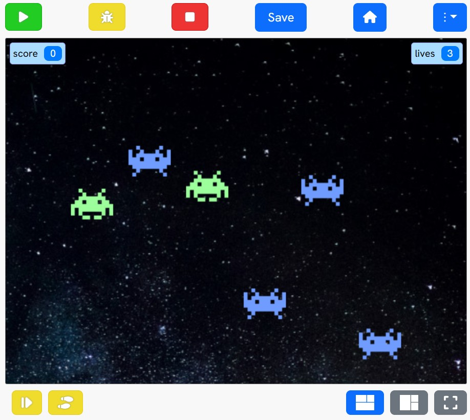

# Debugging with the Pytch Debugger

In this tutorial, you'll learn how to use the Pytch Debugger to find and fix bugs in a broken version of the **_Blue Invaders_** game. You'll use:

- **Variable inspection** to check the values of variables.
- **Breakpoints** to pause the program at a specific line.
- **Stepping** to run the program one line at a time.

The game runs — but something's not quite right. Let's investigate!