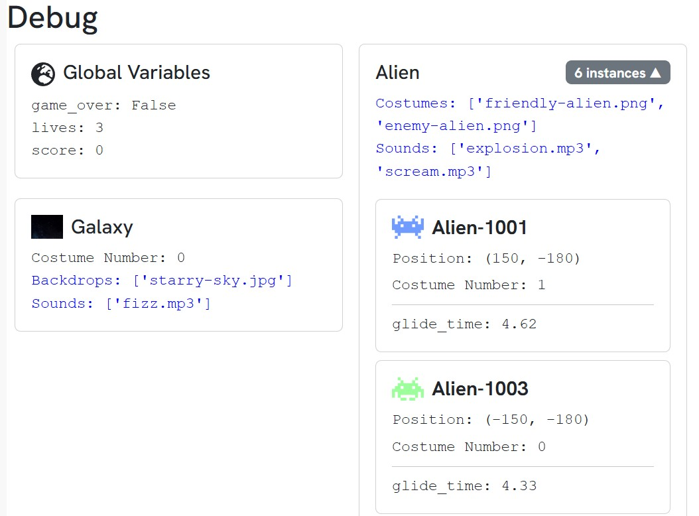
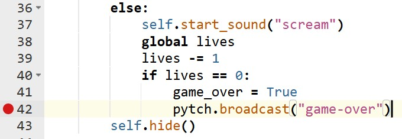
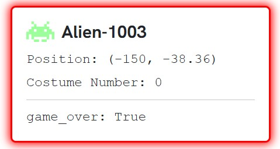

# Debugging with the Pytch Debugger

In this tutorial, you'll learn how to use the Pytch Debugger to find and fix bugs in a broken version of the **_Blue Invaders_** game. You'll use:

- **Variable inspection** to check the values of variables.
- **Breakpoints** to pause the program at a specific line.
- **Stepping** to run the program one line at a time.

The game runs — but something's not quite right. Let's investigate!

---

## The Bugs

The game has three bugs that need to be fixed. Your task is to find and fix them using the Pytch Debugger.  Here’s a summary of the bugs:
- **Bug 1**: You lose a life when you click on an enemy alien.
    - **Expected Behaviour**: Clicking on an enemy alien should award you points.
- **Bug 2**: The game doesn't end when you run out of lives.
    - **Expected Behaviour**: When the lives reach 0, the aliens should disappear when they reach the bottom of the screen, and the game should end.
- **Bug 3**: The aliens always have the "friendly-alien" costume when they first glide down the screen.
    - **Expected Behaviour**: The aliens should randomly choose between the "friendly-alien" and "enemy-alien" costumes.

Run the program and observe each of these bugs happening. In this tutorial, we will go step-by-step through the process of debugging each of these bugs.

## The Debugger Layout

Now, let's see if we can track down these bugs using the Pytch Debugger. When you click the yellow debug button (beside the green play button), Pytch enters debug mode. A new **Debug** tab appears below the code editor. Clicking on it opens the **Debug Panel**.

### The Debug Panel
This panel shows the current state of the program. It contains cards that represent the actors and variables in your program. You can use it to inspect the values of variables and see how they change as the program runs. There are three types of card:
1. **Global Card**: This is the first card on the top left of the panel. It shows you the variables that you defined outside of any class.
2. **Stage Card**: This is the second card, just below the Global Card, and it represents the stage. It shows you any variables that you defined in the stage class, and the current backdrops it is using.
3. **Actor Cards**: The remaining cards represent the actors in your program. Each actor class has its own card, which shows you the variables that you defined in that actor's class. If the actor has been cloned, the clones appear within the card as mini-cards. These mini-cards show you the variables that are specific to that clone, and the current costume it is using.

## Bug 1: Clicking on Aliens

When you click on an enemy alien, you lose a life - but you should gain points instead. Let's see if we can track down the problem using the debug panel.

A good starting point when debugging is to narrow down your search by thinking about where the bug is likely to be. In this case, we know that the bug is related to clicking on aliens, so we can focus on the code that handles the click event for aliens.

Navigate to the portion of the code that handles the click event for aliens - under `@pytch.when_this_sprite_clicked`. This code is responsible for managing what happens when you click on an alien, so it is a good place to start looking for the bug.

You'll see that the code checks the value of `costume_number` to determine whether the alien is friendly or not. The first costume is the friendly alien, and the second is the enemy alien. If the alien is friendly, it awards points. If it is an enemy, it deducts a life.

Let's start the game in debug mode and open the debug panel. Since we know that the bug is related to the `costume_number`, we can inspect the value of this variable in the debug panel. As the aliens change costume, we see that the value of `costume_number` changes between 0 and 1. This means that the aliens are correctly switching between the friendly and enemy costumes.

You might already see the issue: The programmer decided to check if the alien is using its second costume by checking if `costume_number` is equal to 2 - however, we can see from the debug panel that the value of `costume_number` changes between 0 and 1 - Remember: Python starts counting at 0, so the second costume is actually `costume_number == 1`. This means that the the `else` code always runs, and the alien is always treated as an enemy.

### Fixing the Bug
The fix is simple: change the line that checks if the alien is an enemy to check if `costume_number` is equal to 1 instead of 2. This way, the code will correctly identify the enemy alien and award points when you click on it.



## Bug 2: Game doesn't end when you run out of lives
The second bug is that the game doesn't end when you run out of lives. Let's try to track down this bug using **breakpoints**.

As with the first bug, let's narrow down our search. The game should end when clicking on our lives reduce to 0, so let's focus on the code that handles the lives. This code is located in the `else` block of the `@pytch.when_this_sprite_clicked` event handler. This narrows down our search to just a few lines of code.

At first glance, nothing seems to be out of order. The code checks if the lives equal to 0, and if so, it sets game_over to False. This means that when the aliens reach the bottom of the screen, the `while not game_over` in the `drift_down_screen` method should stop running. However, we can see that this does not happen - so what's wrong?

Let's set a breakpoint at the end of the `else` block, on the line containing `pytch.broadcast("game-over")`. Do this by clicking on the line number in the code editor. Now run the game in debug mode and click on three friendly aliens. At this point, the game will freeze, and the line with the breakpoint will be highlighted in red. The program has paused just before this highlighted line has been executed, and we can inspect the values of the variables at this point.

Look down at the debug panel. One of the alien cards is glowing red - this is the alien you just clicked on. You are able to see all of its variables, including the `game_over` variable. However, the `game_over` you want to change is the global one, so it shouldn't show up as a local variable! This is the source of the bug - just like `lives` and `score`, `game_over` is a global variable, so in order to modify it, we need to use the `global` keyword. This is why the game doesn't end when you run out of lives - the code is modifying a local variable instead of the global one.

### Fixing the Bug
To fix the bug, we need to add the `global` keyword to the `else` block of the `@pytch.when_this_sprite_clicked` event handler. This way, the code will modify the global variable instead of creating a new local variable.



## Bug 3: Aliens always start with the friendly costume
The third and final bug is more subtle - the aliens always start with the friendly costume on their first trip down the screen. Let's try to track down this bug with the final feature of the debugger: **stepping**.

Stepping allows you to run the program one line at a time, so you can see how the program flows and what values the variables take on. This is useful for tracking down bugs that are hard to spot just by looking at the code.

Let's build on the techniques we learned with the last two bugs. First, we narrow down our search. There are two possible places this bug could be occuring - when the aliens are created in the `make_clones` method, or when they are gliding down the screen in the `drift_down_screen` method. By inpecting the `make_clones`, we can see it doesn't mention costumes, so let's focus on the `drift_down_screen` method for now.

A quick glance at the `drift_down_screen` method shows that all the correct components are there - the postion is being set, the gliding is happending correctly, and the costume is being randomised. So, let's try stepping through the code to see if we can spot the bug.

To begin, set a breakpoint at the top of the `while` loop on the line that contains `self.show()`. As we now know, this will pause the program when it reaches this line. Run the game in debug mode, and the program will pause once all of the clones have been created. When the program is paused, two buttons appear below the stage - **Continue** and **Step**. Let's take a closer look at each one.

### Continue

The continue button, represented by a right arrow, will continue the program until the next time an sprite hits a breakpoint. Try clicking on it to see what happens. The program will continue until the aliens reach the bottom of the screen, and then it will pause again. Take a look at the glowing alien card in the debug panel. You will notice that the glowing card changes depending on which alien hits the bottom of the screen. Click the button a few more times to see how the glowing card changes.

### Step

The step button, represented by a pair of footprints, will run the program one line at a time. This is useful for tracking down bugs that are hard to spot just by looking at the code. Click on the step button to see what happens. You will see that the red line moves down one line at a time - the highlighted line is the _next_ line of code that will run.

As you step through the code, take note of the glowing red alien card. As you step over the line that sets the `glide_time` variable, notice how the value updates. When the `self.glide_to_xy` line is reached, the alien glides to the bottom of the screen, but behaviour is slightly different than when we clicked the continue button. As other aliens reach the bottom of the screen, the glowing card stays the same. The step button allows you to step through the code for only the current sprite, not allowing other sprites to interrupt.

### The bug

Right, let's get back to the task at hand. Restart the program by clicking again on the yellow debug button. The you set previously remains, so the program will pause at the same point in time. Now step through the code again, and see if you can spot the problem.

### The solution

The problem occurs because the costume change comes after the glide, so all aliens start with the default (friendly) look. They only change costume after they’ve already been seen by the player. This means that the alien will always start with the friendly costume, and then change to the random costume for the second loop. To fix this issue, we can move the `self.switch_costume` line to _before_ the `self.glide_to_xy` line. This way, the alien will randomise its costume before it starts gliding down the screen.



## Summary

With that, you've learned the fundamentals of the Pytch Debugger! Let's recap the techniques we learned:

1. Narrow down your search by thinking about where the bug is likely to be.
2. Use **variable inspection** to check the values of variables.
3. Use **breakpoints** to pause the program at a specific line and inspect the values of variables.
4. Use **stepping** to run the program one line at a time and see how the program flows.

A debugger is a powerful tool that will save you lots of time and frustration when you're trying to track down bugs in your code. Like any tool, mastering it requires practice. Try exploring the debugger with your own projects - you can use the same techniques discussed here to track down bugs in your own code. The more you time you spend, the better you'll get at debugging. Debugging is an important skill, and these tools can help you master it!
